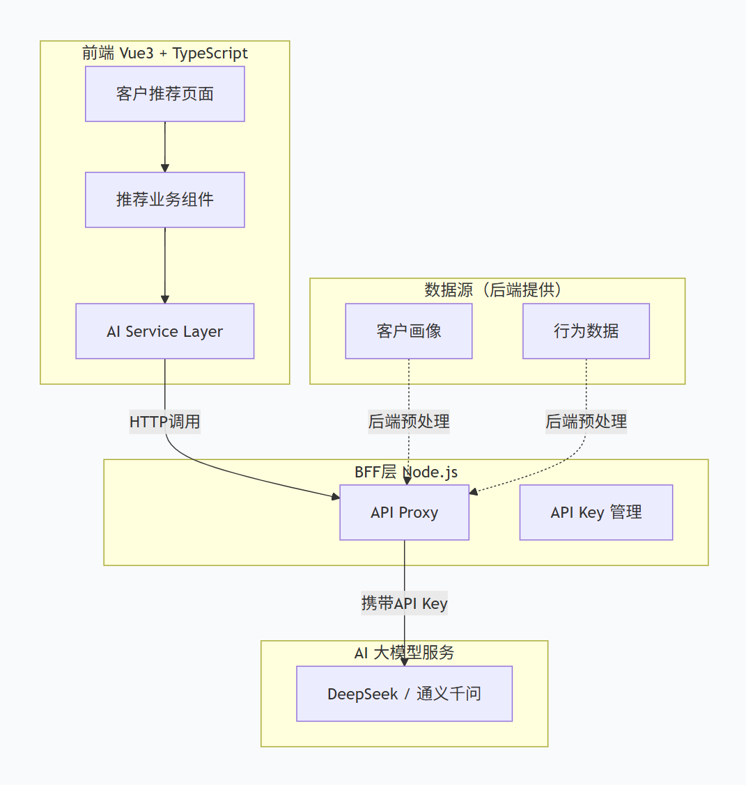
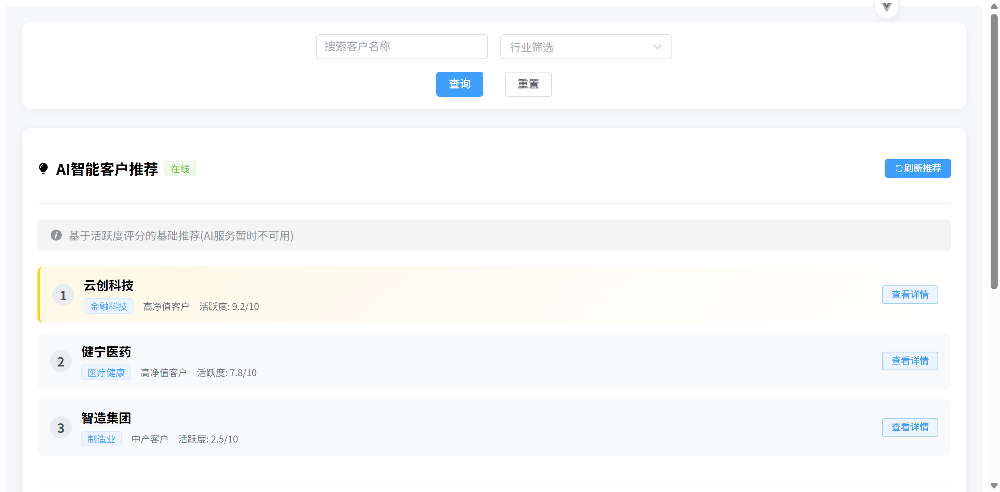

## 项目简介

金融CRM系统中的“智能客户推荐”功能，核心是利用AI大模型对客户数据进行语义理解与智能匹配，为销售团队推送最适合当前跟进策略的目标客户，或为特定产品推荐潜在高意向客户。

## 核心技术

1、模型选型与后端代理：选用 DeepSeek国内主流大模型，Node.js BFF层搭建代理（使用Express框架），大模型API Key存放于BFF层保护密钥安全

2、数据预处理与Prompt设计：后端对客户数据进行特征提取和结构化清洗，生成语义化摘要；设计了安全合规的推荐Prompt模板

3、前端服务层封装：TypeScript类型安全的服务层，集成防抖、缓存与降级策略

4、UI组件开发：Vue3 + Element Plus构建的推荐面板，包含排名展示、推荐理由、跟进话术和一键复制

## 架构图



## 项目演示



## 项目结构

```text
├── server/                   # 后端
│   ├── src/                  # 应用代码
│   │   └── index.js          # 后端代理API
│   └── package.json          # 后端依赖配置
├── client/                   # 前端
│   ├── src/                  # 源代码
│   ├── Element-plus.d.ts     # Element Plus自动导入ElMesaage
│   ├── tsconfig.json         # typescript配置
│   ├── vite.config.json      # vite配置
│   └── package.json          # 前端依赖配置
├── images/                   # 项目展示效果图
└── README.md                 # 项目说明文档
```

## 快速开始

### 环境要求

node.js版本要求22.22.X

### 克隆项目

```bash
git clone https://github.com/hln188/hln_ai_programs_repository.git
```

### 服务端安装依赖及运行

```bash
cd server
npm i
npm run dev
```

### 客户端安装依赖及运行

```bash
cd client
npm i
npm run dev
```
